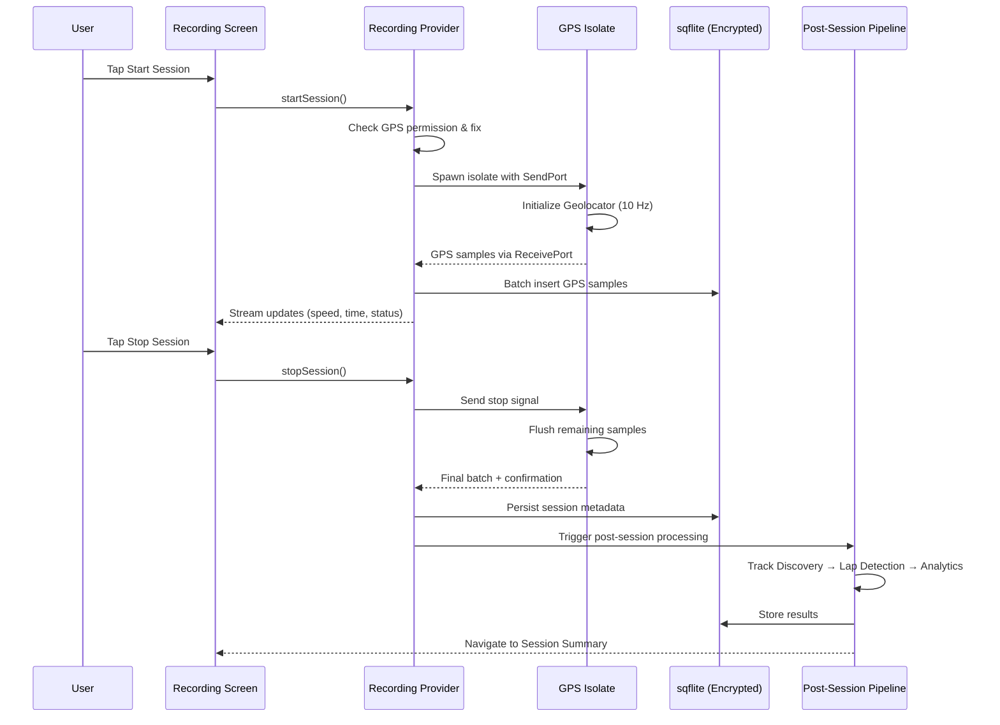

# Design Document: APXTracer

## Overview

APXTracer is a local-only mobile telemetry application built with Flutter that records GPS data during motorsport sessions and automatically generates track maps, lap timing, sector analysis, and performance insights. The architecture prioritizes real-time GPS capture at 10 Hz on a background isolate and local data persistence with encrypted storage.

The system is decomposed into four core engines (Recording, Track Discovery, Lap Detection, Analytics) plus an Export Engine, coordinated through Riverpod state management. All computation and storage happens entirely on-device.

### Key Design Decisions

1. **Background Isolate for GPS**: Recording runs on a dedicated Dart isolate to guarantee 10 Hz capture without UI jank, communicating via `SendPort`/`ReceivePort`.
2. **Local-Only Storage**: All data is written to sqflite with no cloud dependency. The app works entirely offline.
3. **Automatic Track Discovery**: Closed-loop detection uses a 50m Haversine distance threshold between first and last GPS samples.
4. **Sector Splitting via Polyline Distance**: Sectors are placed at 1/3 and 2/3 cumulative polyline distance, with crossing times computed via linear interpolation.
5. **Encrypted Local Storage**: sqflite database is encrypted using SQLCipher (via `sqflite_sqlcipher` package) with a key derived from device secure storage.

## Architecture

```mermaid
graph TB
    subgraph UI Layer
        HomeScreen[Home Screen]
        RecordingScreen[Recording Screen]
        SessionSummary[Session Summary]
        SessionHistory[Session History]
        SessionDetail[Session Detail]
        TrackLibrary[Track Library]
        SettingsScreen[Settings Screen]
    end

    subgraph State Management - Riverpod
        SessionState[Session State Provider]
        RecordingState[Recording State Provider]
        AnalyticsState[Analytics State Provider]
        TrackState[Track State Provider]
    end

    subgraph Engine Layer
        RecordingEngine[Recording Engine\n- Background Isolate\n- 10 Hz GPS Capture]
        TrackDiscovery[Track Discovery Engine\n- Closed Loop Detection\n- Sector Splitting]
        LapDetection[Lap Detection Engine\n- Start/Finish Crossing\n- Sector Crossing]
        AnalyticsEngine[Analytics Engine\n- Speed/Distance Calc\n- Best Lap/Sector]
        ExportEngine[Export Engine\n- CSV/JSON Generation]
    end

    subgraph Data Layer
        LocalDB[(sqflite - Encrypted)]
        SecureStorage[Flutter Secure Storage]
    end

    UI Layer --> State Management - Riverpod
    State Management - Riverpod --> Engine Layer
    Engine Layer --> Data Layer
```

### Data Flow: Session Recording



### Routing Structure (go_router)

| Route | Screen | Description |
|-------|--------|-------------|
| `/` | Home | Dashboard with quick-start recording |
| `/recording` | Recording | Active session with live telemetry |
| `/session/:id/summary` | Session Summary | Post-session analytics |
| `/sessions` | Session History | All past sessions |
| `/session/:id` | Session Detail | Full session analysis |
| `/tracks` | Track Library | All discovered tracks |
| `/settings` | Settings | App preferences |

## Components and Interfaces

### 1. Recording Engine

Runs GPS capture on a background Dart isolate to avoid UI thread blocking.

```dart
/// Message types sent between main isolate and recording isolate
sealed class RecordingMessage {}
class StartRecording extends RecordingMessage {
  final int targetHz; // 10
}
class StopRecording extends RecordingMessage {}
class GpsSampleBatch extends RecordingMessage {
  final List<GpsSample> samples;
}
class RecordingError extends RecordingMessage {
  final String code;
  final String message;
}

/// Public interface for the Recording Engine
abstract class IRecordingEngine {
  /// Starts a new session. Returns session ID.
  /// Throws [GpsPermissionDeniedException] if location not granted.
  /// Throws [GpsFixTimeoutException] if no fix within 10 seconds.
  Future<String> startSession();

  /// Stops the active session. Finalizes and persists all data.
  Future<Session> stopSession();

  /// Stream of live recording state updates for UI consumption.
  Stream<RecordingUpdate> get updates;

  /// Whether a session is currently active.
  bool get isRecording;
}

class RecordingUpdate {
  final double currentSpeedKmh;
  final Duration elapsed;
  final GpsStatus gpsStatus;
  final int sampleCount;
}

enum GpsStatus { acquiring, active, signalLost, noPermission }
```

### 2. Track Discovery Engine

Analyzes GPS paths to detect closed-loop circuits and generate track geometry.

```dart
abstract class ITrackDiscoveryEngine {
  /// Analyzes a session's GPS path for closed-loop detection.
  /// Returns the discovered or matched Track, or null if no closed loop.
  Future<Track?> discoverTrack(Session session, List<GpsSample> samples);

  /// Splits a track into 3 sectors at 1/3 and 2/3 polyline distance.
  /// Returns sector boundary points as polyline distance fractions.
  List<SectorBoundary> computeSectors(Track track);
}

class SectorBoundary {
  final double polylineFraction; // 0.0 to 1.0
  final LatLng point; // Interpolated geographic point
}
```

### 3. Lap Detection Engine

Identifies laps and sector crossings within a session.

```dart
abstract class ILapDetectionEngine {
  /// Detects laps by finding start/finish line crossings.
  /// Filters false detections (< 10 second laps).
  Future<List<Lap>> detectLaps(
    List<GpsSample> samples,
    Track track,
  );

  /// Calculates sector times for each lap using linear interpolation.
  Future<List<LapSectors>> computeSectorTimes(
    List<Lap> laps,
    List<GpsSample> samples,
    List<SectorBoundary> boundaries,
  );
}

class LapSectors {
  final int lapNumber;
  final int? sector1Ms; // null if unavailable
  final int? sector2Ms;
  final int? sector3Ms;
}
```

### 4. Analytics Engine

Computes all session metrics from local data.

```dart
abstract class IAnalyticsEngine {
  /// Computes full session analytics from GPS samples and detected laps.
  Future<SessionAnalytics> computeAnalytics(
    Session session,
    List<GpsSample> samples,
    List<Lap> laps,
    List<LapSectors> sectorTimes,
  );
}

class SessionAnalytics {
  final double durationSeconds;
  final double distanceKm; // 2 decimal places
  final int totalLaps;
  final int? bestLapTimeMs; // null if no laps
  final int? averageLapTimeMs; // null if no laps
  final double averageSpeedKmh; // 1 decimal place
  final double maxSpeedKmh; // 1 decimal place
  final List<double> speedTraceKmh; // one per sample
  final int? bestSector1Ms;
  final int? bestSector2Ms;
  final int? bestSector3Ms;
}
```

### 5. Export Engine

Generates CSV and JSON export files and handles export to Google Drive or platform share sheet.

```dart
abstract class IExportEngine {
  /// Generates a CSV file for the given session.
  /// Returns the file path of the generated CSV.
  Future<String> exportCsv(String sessionId);

  /// Generates a JSON file for the given session.
  /// Returns the file path of the generated JSON.
  Future<String> exportJson(String sessionId);

  /// Uploads a file to the user's Google Drive.
  /// Throws [GoogleDriveAuthException] if authentication fails.
  /// Throws [GoogleDriveUploadException] if upload fails.
  Future<void> uploadToGoogleDrive(String filePath);

  /// Presents the platform share sheet for the given file.
  Future<void> shareFile(String filePath);
}
```

### 6. Google Drive Service

Handles Google Sign-In and Drive API interactions for export.

```dart
abstract class IGoogleDriveService {
  /// Authenticates with Google and returns access credentials.
  /// Throws [GoogleDriveAuthException] if user denies or auth fails.
  Future<void> authenticate();

  /// Uploads a file to the authenticated user's Google Drive.
  /// Throws [GoogleDriveUploadException] on failure.
  Future<String> uploadFile(String filePath, String fileName);

  /// Whether the user is currently authenticated with Google.
  bool get isAuthenticated;
}
```

## Data Models

### Local Database Schema (sqflite with SQLCipher encryption)

```sql
-- Sessions table
CREATE TABLE sessions (
  id TEXT PRIMARY KEY,
  start_time INTEGER NOT NULL,        -- Unix epoch ms
  end_time INTEGER,                    -- Unix epoch ms
  duration_ms INTEGER,
  track_id TEXT,
  created_at INTEGER NOT NULL,
  FOREIGN KEY (track_id) REFERENCES tracks(id)
);

-- GPS Samples table (high volume - optimized for sequential writes)
CREATE TABLE gps_samples (
  id INTEGER PRIMARY KEY AUTOINCREMENT,
  session_id TEXT NOT NULL,
  timestamp INTEGER NOT NULL,          -- Unix epoch ms
  latitude REAL NOT NULL,
  longitude REAL NOT NULL,
  altitude REAL,                       -- meters
  speed REAL,                          -- m/s
  heading REAL,                        -- degrees 0-360
  accuracy REAL,                       -- meters
  is_low_accuracy INTEGER DEFAULT 0,   -- 1 if accuracy > 50m
  FOREIGN KEY (session_id) REFERENCES sessions(id)
);
CREATE INDEX idx_samples_session ON gps_samples(session_id, timestamp);

-- Tracks table
CREATE TABLE tracks (
  id TEXT PRIMARY KEY,
  name TEXT,
  polyline TEXT NOT NULL,              -- JSON encoded List<LatLng>
  start_lat REAL NOT NULL,
  start_lng REAL NOT NULL,
  sector1_fraction REAL NOT NULL,      -- 0.333...
  sector2_fraction REAL NOT NULL,      -- 0.666...
  session_count INTEGER DEFAULT 1,
  last_driven INTEGER NOT NULL,        -- Unix epoch ms
  created_at INTEGER NOT NULL
);

-- Laps table
CREATE TABLE laps (
  id TEXT PRIMARY KEY,
  session_id TEXT NOT NULL,
  track_id TEXT NOT NULL,
  lap_number INTEGER NOT NULL,
  start_timestamp INTEGER NOT NULL,    -- Unix epoch ms
  end_timestamp INTEGER NOT NULL,      -- Unix epoch ms
  lap_time_ms INTEGER NOT NULL,
  sector1_ms INTEGER,                  -- null if unavailable
  sector2_ms INTEGER,
  sector3_ms INTEGER,
  is_best_lap INTEGER DEFAULT 0,
  FOREIGN KEY (session_id) REFERENCES sessions(id),
  FOREIGN KEY (track_id) REFERENCES tracks(id)
);
CREATE INDEX idx_laps_session ON laps(session_id);

-- Session Analytics (cached computation results)
CREATE TABLE session_analytics (
  session_id TEXT PRIMARY KEY,
  duration_seconds REAL NOT NULL,
  distance_km REAL NOT NULL,
  total_laps INTEGER NOT NULL,
  best_lap_time_ms INTEGER,
  average_lap_time_ms INTEGER,
  average_speed_kmh REAL NOT NULL,
  max_speed_kmh REAL NOT NULL,
  speed_trace TEXT NOT NULL,           -- JSON encoded List<double>
  best_sector1_ms INTEGER,
  best_sector2_ms INTEGER,
  best_sector3_ms INTEGER,
  FOREIGN KEY (session_id) REFERENCES sessions(id)
);
```

### Dart Data Classes

```dart
class GpsSample {
  final int timestamp;      // Unix epoch ms
  final double latitude;
  final double longitude;
  final double? altitude;   // meters
  final double? speed;      // m/s
  final double? heading;    // degrees 0-360
  final double? accuracy;   // meters
  final bool isLowAccuracy; // accuracy > 50m

  const GpsSample({
    required this.timestamp,
    required this.latitude,
    required this.longitude,
    this.altitude,
    this.speed,
    this.heading,
    this.accuracy,
    this.isLowAccuracy = false,
  });
}

class Session {
  final String id;
  final int startTime;      // Unix epoch ms
  final int? endTime;       // Unix epoch ms
  final int? durationMs;
  final String? trackId;

  const Session({
    required this.id,
    required this.startTime,
    this.endTime,
    this.durationMs,
    this.trackId,
  });
}

class Track {
  final String id;
  final String? name;
  final List<LatLng> polyline;
  final LatLng startFinish;
  final double sector1Fraction; // 0.333
  final double sector2Fraction; // 0.666
  final int sessionCount;
  final int lastDriven;         // Unix epoch ms

  const Track({
    required this.id,
    this.name,
    required this.polyline,
    required this.startFinish,
    this.sector1Fraction = 1 / 3,
    this.sector2Fraction = 2 / 3,
    this.sessionCount = 1,
    required this.lastDriven,
  });
}

class Lap {
  final String id;
  final String sessionId;
  final String trackId;
  final int lapNumber;
  final int startTimestamp;   // Unix epoch ms
  final int endTimestamp;     // Unix epoch ms
  final int lapTimeMs;
  final int? sector1Ms;
  final int? sector2Ms;
  final int? sector3Ms;
  final bool isBestLap;

  const Lap({
    required this.id,
    required this.sessionId,
    required this.trackId,
    required this.lapNumber,
    required this.startTimestamp,
    required this.endTimestamp,
    required this.lapTimeMs,
    this.sector1Ms,
    this.sector2Ms,
    this.sector3Ms,
    this.isBestLap = false,
  });
}
```

## Correctness Properties

*These properties define the expected behaviors that must hold true. They are validated through mock-based unit tests with mocked dependencies rather than property-based testing.*

### Property 1: Zero Telemetry Loss

Every GPS sample acquired from the sensor appears in the local database after session finalization, with no samples missing or duplicated.

**Validates: Requirements 1.2, 1.5, 2.8, 12.3**

### Property 2: GPS Sample Structure Preservation

All provided sensor fields (required and optional) are stored with their original values unchanged.

**Validates: Requirements 2.1, 2.3, 2.4, 2.5, 2.6**

### Property 3: Chronological Ordering

Stored GPS samples maintain strictly ascending timestamp order.

**Validates: Requirements 2.7**

### Property 4: Low-Accuracy Flagging

isLowAccuracy is true if and only if accuracy > 50 meters; sample is always persisted.

**Validates: Requirements 2.9**

### Property 5: Closed-Loop Detection

A closed loop is detected if and only if Haversine(first, last) ≤ 50m AND sample count ≥ 20.

**Validates: Requirements 3.1, 3.2, 3.5**

### Property 6: Track Matching

If an existing track's start/finish is within 50m, the session associates with it instead of creating a duplicate.

**Validates: Requirements 3.3, 3.4**

### Property 7: Lap Crossing with False Detection Filtering

Crossings within 15m of start/finish are detected; laps < 10 seconds are discarded.

**Validates: Requirements 4.2, 4.5**

### Property 8: Sequential Lap Numbering

Lap numbers form a contiguous sequence from 1 to N with no gaps.

**Validates: Requirements 4.3**

### Property 9: Lap Time Calculation

Lap time equals the difference between consecutive crossing timestamps in milliseconds.

**Validates: Requirements 4.4**

### Property 10: Best Time Identification

Best lap/sector is the one with the minimum time value.

**Validates: Requirements 4.6, 5.3**

### Property 11: Sector Boundary Placement

Boundaries at exactly L/3 and 2L/3 cumulative polyline distance.

**Validates: Requirements 5.1**

### Property 12: Sector Time Interpolation

Crossing timestamps computed via linear interpolation between straddling samples; null if no straddling pair exists.

**Validates: Requirements 5.2, 5.6**

### Property 13: Analytics Computation

Distance = sum of Haversine between consecutive samples; speeds converted from m/s to km/h correctly.

**Validates: Requirements 6.1, 6.2, 6.3**

### Property 14: Collection Ordering

Tracks ordered by last_driven descending; sessions ordered by start_time descending.

**Validates: Requirements 7.1, 8.1**

### Property 15: Track Name Validation

Accepted if 1 ≤ length ≤ 50; rejected otherwise with previous name retained.

**Validates: Requirements 7.2, 7.3**

### Property 16: Export Round-Trip

CSV and JSON exports contain all samples in chronological order with correct field values.

**Validates: Requirements 9.1, 9.2**

## Error Handling

### GPS Errors

| Error Condition | Handling Strategy |
|----------------|-------------------|
| Permission denied | Show error message, prevent session start, guide to settings |
| No GPS fix within 10s | Show timeout error, prevent session start |
| Signal lost during session | Continue recording, mark gap, resume on signal restore |
| Accuracy > 50m | Flag sample as low-accuracy, still persist |
| Low memory (< 50MB) | Continue recording, show warning to user |

### Export Errors

| Error Condition | Handling Strategy |
|----------------|-------------------|
| Insufficient storage | Show error with reason, preserve original data |
| Data read error | Show error with reason, preserve original data |
| Empty session (0 samples) | Disable export option |
| Google Drive auth failure | Show error, offer share sheet as fallback |
| Google Drive upload failure | Show error, offer share sheet as fallback |

### Data Integrity

- All database writes use transactions to prevent partial writes
- Session finalization is atomic: either all data persists or none does
- Data deletion removes all session, track, lap, and sample records atomically

## Testing Strategy

### Approach: Mock-Based Unit Tests with Maximum Coverage

**Library**: `flutter_test` + `mockito` (via `build_runner` code generation) + `mocktail` for lightweight mocks

**Goal**: Achieve maximum test coverage by mocking all external dependencies (GPS sensor, database, file system, Google Drive API) and testing each engine in isolation.

### Recording Engine Tests

| Test Case | Mocks | Validates |
|-----------|-------|-----------|
| startSession returns session ID within 1s | Mock Geolocator, Mock DB | Req 1.1 |
| GPS samples stored sequentially with zero loss | Mock Geolocator stream, Mock DB | Req 1.2, 2.8 |
| Recording continues without internet | Mock connectivity (offline) | Req 1.3 |
| stopSession persists all data within 3s | Mock DB transaction | Req 1.5 |
| Signal loss resumes without data loss | Mock Geolocator with gap | Req 1.6 |
| UI updates stream at 1Hz minimum | Mock Geolocator | Req 1.7 |
| Permission denied throws exception | Mock Geolocator (denied) | Req 1.8 |
| Prevents duplicate concurrent sessions | Mock state | Req 1.9 |
| GPS fix timeout after 10s throws exception | Mock Geolocator (no fix) | Req 1.10 |
| Captures at 10 Hz rate | Mock Geolocator (timed stream) | Req 2.2 |
| Required fields always present | Mock Geolocator | Req 2.1 |
| Optional fields included when available | Mock Geolocator (full data) | Req 2.3-2.6 |
| Chronological order preserved | Mock Geolocator (ordered) | Req 2.7 |
| Low-accuracy flagged when > 50m | Mock Geolocator (accuracy=60) | Req 2.9 |
| Low-accuracy sample still persisted | Mock Geolocator, Mock DB | Req 2.9 |

### Track Discovery Engine Tests

| Test Case | Mocks | Validates |
|-----------|-------|-----------|
| Detects closed loop when last within 50m of first | Mock DB (samples) | Req 3.1 |
| No detection when distance > 50m | Mock DB (samples) | Req 3.1 |
| No detection when < 20 samples | Mock DB (samples) | Req 3.2 |
| Generates polyline from GPS path | Mock DB | Req 3.2 |
| Matches existing track within 50m | Mock DB (existing tracks) | Req 3.3 |
| Creates new track when no match | Mock DB (empty library) | Req 3.4 |
| Session stored without track when no loop | Mock DB | Req 3.5 |
| Sectors placed at 1/3 and 2/3 distance | None (pure computation) | Req 5.1 |

### Lap Detection Engine Tests

| Test Case | Mocks | Validates |
|-----------|-------|-----------|
| Detects crossings within 15m of start/finish | Mock samples, track | Req 4.2 |
| Assigns sequential lap numbers from 1 | Mock samples, track | Req 4.3 |
| Calculates lap time as timestamp difference | Mock samples | Req 4.4 |
| Discards laps < 10 seconds | Mock samples (close crossings) | Req 4.5 |
| Identifies best lap (minimum time) | Mock laps | Req 4.6 |
| Excludes incomplete partial laps | Mock samples | Req 4.3 |
| Sector times via linear interpolation | Mock samples, boundaries | Req 5.2 |
| Sector time null when no straddling pair | Mock samples (gap) | Req 5.6 |
| Best sector time is minimum non-null | Mock sector times | Req 5.3 |

### Analytics Engine Tests

| Test Case | Mocks | Validates |
|-----------|-------|-----------|
| Calculates duration correctly | Mock session | Req 6.1 |
| Distance via Haversine sum (2 decimal km) | Mock samples | Req 6.1 |
| Total laps from detected laps | Mock laps | Req 6.1 |
| Best lap time is minimum | Mock laps | Req 6.1 |
| Average lap time computed correctly | Mock laps | Req 6.1 |
| Average speed = distance / duration (1 decimal) | Mock samples | Req 6.2 |
| Max speed = max sample speed in km/h | Mock samples | Req 6.2 |
| Speed trace has one entry per sample | Mock samples | Req 6.3 |
| Zero laps: total=0, best/avg omitted | Mock (no laps) | Req 6.6 |
| All computation works without internet | Mock (no connectivity) | Req 6.7 |

### Export Engine Tests

| Test Case | Mocks | Validates |
|-----------|-------|-----------|
| CSV has correct header row | Mock DB (samples) | Req 9.1 |
| CSV rows match sample count and order | Mock DB (samples) | Req 9.1 |
| JSON has "samples" array with correct fields | Mock DB (samples) | Req 9.2 |
| JSON preserves chronological order | Mock DB (samples) | Req 9.2 |
| Export available for sessions with ≥1 sample | Mock DB | Req 9.3 |
| Export disabled for empty sessions | Mock DB (0 samples) | Req 9.3 |
| Export works without internet | Mock (offline) | Req 9.4 |
| Google Drive auth success uploads file | Mock GoogleDriveService | Req 9.6 |
| Google Drive auth failure shows error + fallback | Mock GoogleDriveService (fail) | Req 9.7 |
| Google Drive upload failure shows error + fallback | Mock GoogleDriveService (upload fail) | Req 9.7 |
| Insufficient storage shows error, preserves data | Mock file system (full) | Req 9.8 |

### Track Library Tests

| Test Case | Mocks | Validates |
|-----------|-------|-----------|
| Tracks ordered by last_driven descending | Mock DB | Req 7.1 |
| Name edit accepted (1-50 chars) | Mock DB | Req 7.2 |
| Empty name rejected, previous retained | Mock DB | Req 7.3 |
| Name > 50 chars rejected | Mock DB | Req 7.3 |
| Session count and last driven displayed | Mock DB | Req 7.4 |

### Session History Tests

| Test Case | Mocks | Validates |
|-----------|-------|-----------|
| Sessions in reverse chronological order | Mock DB | Req 8.1 |
| Correct metrics displayed per session | Mock DB | Req 8.2 |
| Available offline from local data | Mock DB (offline) | Req 8.3 |
| Session detail shows visualization + graph | Mock DB, session | Req 8.4 |
| No-track session shows GPS path + "no laps" | Mock DB (no track) | Req 8.5 |
| Empty state when no sessions | Mock DB (empty) | Req 8.6 |

### Data Privacy Tests

| Test Case | Mocks | Validates |
|-----------|-------|-----------|
| Database encrypted with SQLCipher | Mock secure storage | Req 10.1 |
| Data deletion removes all records atomically | Mock DB (transaction) | Req 10.3 |

### Performance Tests (Integration)

| Test Case | Validates |
|-----------|-----------|
| 60-min recording: memory < 50MB growth | Req 12.2 |
| UI maintains 60 FPS during recording | Req 12.1 |
| Battery < 15% per 60 min | Req 12.4 |
| Low memory warning displayed at < 50MB | Req 12.5 |

### Test File Structure

```
test/
├── engines/
│   ├── recording_engine_test.dart
│   ├── track_discovery_engine_test.dart
│   ├── lap_detection_engine_test.dart
│   ├── analytics_engine_test.dart
│   └── export_engine_test.dart
├── services/
│   └── google_drive_service_test.dart
├── data/
│   ├── session_repository_test.dart
│   ├── track_repository_test.dart
│   ├── gps_sample_repository_test.dart
│   └── lap_repository_test.dart
├── providers/
│   ├── recording_provider_test.dart
│   ├── session_provider_test.dart
│   ├── track_provider_test.dart
│   └── analytics_provider_test.dart
├── utils/
│   ├── haversine_test.dart
│   ├── time_formatter_test.dart
│   └── polyline_utils_test.dart
└── integration/
    ├── session_recording_flow_test.dart
    └── performance_test.dart
```
