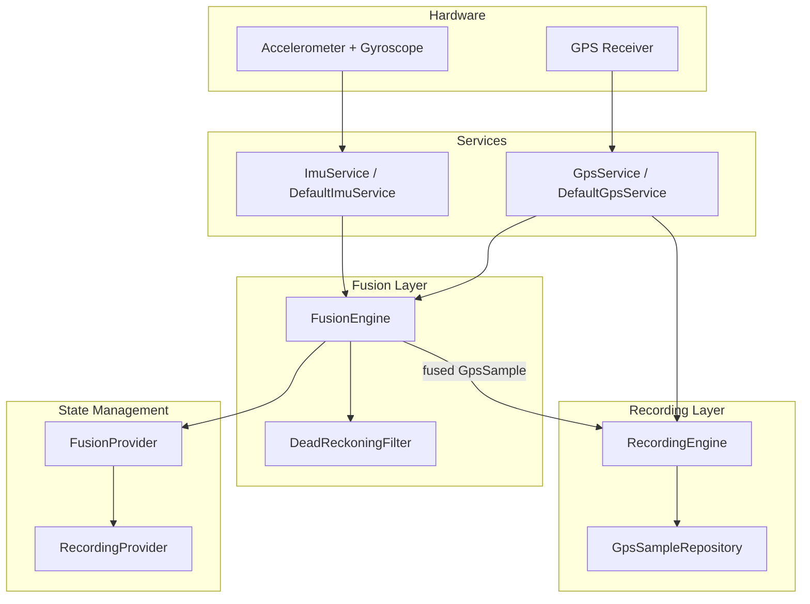
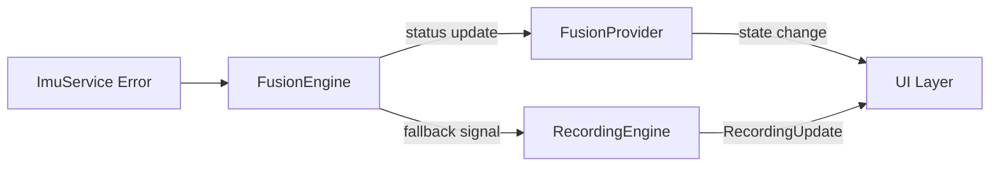

# Design Document: IMU Kalman Sensor Fusion

## Overview

This design integrates IMU sensor fusion into ApxTracer's GPS-only recording pipeline. The system introduces three new components — `ImuService`, `FusionEngine`, and `FusionProvider` — that sit between the existing `GpsService`/`RecordingEngine` and the persistence layer. When IMU hardware is available, the `FusionEngine` orchestrates the existing `DeadReckoningFilter` (15-state EKF) to produce fused `GpsSample` output at the GPS fix rate (1–10 Hz), with 100 Hz IMU predictions filling the gaps between fixes. When IMU is unavailable or interrupted, the system falls back transparently to the existing GPS-only path.

**Key design decisions:**
- The `ImuService` is an abstract interface (like `GpsService`) to enable testing without hardware.
- The `FusionEngine` owns the filter lifecycle and all timing/fallback logic; `RecordingEngine` delegates to it but retains session management.
- `NavState → GpsSample` conversion is a pure function, making it independently testable.
- Riverpod state management follows the existing `StateNotifier` pattern used by `RecordingNotifier`.

## Architecture



**Data flow (fusion active):**
1. `ImuService` delivers `ImuData` at ~100 Hz → `FusionEngine.onImuData`
2. `GpsService` delivers `Position` at 1–10 Hz → `FusionEngine.onGpsFix`
3. `FusionEngine` calls `DeadReckoningFilter.predictWithImu` for each IMU sample
4. `FusionEngine` converts `Position` → `GpsData`, calls `DeadReckoningFilter.updateWithGps`
5. `FusionEngine` reads `NavState`, converts to `GpsSample`, emits to `RecordingEngine`
6. `RecordingEngine` buffers and persists via `GpsSampleRepository`

**Data flow (GPS-only fallback):**
1. `GpsService` delivers `Position` → `RecordingEngine._onPositionReceived` (existing path)
2. `RecordingEngine` converts `Position` → `GpsSample` and persists directly

## Components and Interfaces

### ImuService (Abstract)

```dart
/// Abstract IMU service for accelerometer and gyroscope data acquisition.
/// Mirrors the GpsService pattern for testability via dependency injection.
abstract class ImuService {
  /// Checks whether the device has both accelerometer and gyroscope hardware.
  /// Returns true if both sensors are available.
  Future<bool> checkAvailability();

  /// Starts streaming IMU data at the highest available rate (targeting 100 Hz).
  /// Returns a broadcast stream of ImuData measurements.
  /// Throws [ImuUnavailableException] if sensors are not accessible.
  Stream<ImuData> startStreaming();

  /// Stops streaming and releases hardware resources.
  Future<void> stopStreaming();

  /// Stream that emits warnings when sample rate degrades below 50 Hz.
  Stream<ImuDegradedWarning> get warnings;
}
```

### DefaultImuService (Implementation)

```dart
/// Implementation using sensors_plus plugin.
/// Applies platform-specific coordinate transforms to match
/// the DeadReckoningFilter body frame convention (X=right, Y=forward, Z=up).
class DefaultImuService implements ImuService {
  StreamSubscription<AccelerometerEvent>? _accelSub;
  StreamSubscription<GyroscopeEvent>? _gyroSub;
  
  // Pairs accel + gyro samples by timestamp proximity
  // to produce unified ImuData objects.
  final StreamController<ImuData> _imuController;
  final StreamController<ImuDegradedWarning> _warningController;
  
  // Rate monitoring
  DateTime? _lastSampleTime;
  int _sampleCount = 0;
  Timer? _rateCheckTimer;
}
```

### FusionEngine

```dart
/// Orchestrates the DeadReckoningFilter lifecycle, coordinates IMU and GPS
/// streams, handles initialization sequencing, and produces fused output.
class FusionEngine {
  final DeadReckoningFilter _filter;
  final ImuService _imuService;

  FusionStatus _status = FusionStatus.uninitialized;
  
  // Initialization state
  final List<ImuData> _alignmentSamples = [];
  int _alignmentAttempts = 0;
  static const int _maxAlignmentAttempts = 3;
  static const Duration _alignmentDuration = Duration(milliseconds: 500);
  
  // Fallback detection
  DateTime? _lastImuTimestamp;
  static const Duration _imuGapFallback = Duration(milliseconds: 200);
  static const Duration _imuGapReinit = Duration(milliseconds: 500);
  Timer? _imuWatchdogTimer;
  
  // Last known attitude for short-gap recovery
  double _lastRoll = 0.0;
  double _lastPitch = 0.0;

  // Output
  final StreamController<GpsSample> _fusedSampleController;
  final StreamController<FusionStatusUpdate> _statusController;

  /// Starts the fusion pipeline. Called by RecordingEngine at session start.
  Future<void> start();

  /// Stops the fusion pipeline. Called by RecordingEngine at session stop.
  Future<void> stop();

  /// Handles incoming IMU data from ImuService.
  void onImuData(ImuData data);

  /// Handles incoming GPS fix. Returns fused GpsSample or null if in fallback.
  GpsSample? onGpsFix(Position position);

  /// Stream of fused GpsSample output for RecordingEngine consumption.
  Stream<GpsSample> get fusedSamples;

  /// Current fusion status for provider consumption.
  FusionStatus get status;
  Stream<FusionStatusUpdate> get statusUpdates;
}
```

### FusionStatus Enum

```dart
/// Lifecycle states of the FusionEngine.
enum FusionStatus {
  /// Not started, no resources allocated.
  uninitialized,
  
  /// Collecting stationary IMU samples for gravity alignment.
  aligning,
  
  /// Gravity alignment done, waiting for first valid GPS fix.
  initialized,
  
  /// Filter running, producing fused output.
  active,
  
  /// IMU stream interrupted; passing GPS directly to persistence.
  fallback,
  
  /// Unrecoverable error (alignment failure, GPS timeout, etc.).
  error,
}
```

### FusionProvider (Riverpod)

```dart
/// Immutable state exposed by the FusionProvider.
class FusionState {
  final FusionStatus status;
  final String? errorMessage;
  final NavState? navState;
  final RecordingUpdate? latestUpdate;

  const FusionState({
    this.status = FusionStatus.uninitialized,
    this.errorMessage,
    this.navState,
    this.latestUpdate,
  });
}

/// StateNotifier managing fusion lifecycle state for UI consumption.
class FusionNotifier extends StateNotifier<FusionState> {
  final FusionEngine _fusionEngine;
  StreamSubscription<FusionStatusUpdate>? _statusSub;

  FusionNotifier({required FusionEngine fusionEngine});
}

/// Provider definitions following existing pattern.
final fusionProvider = StateNotifierProvider<FusionNotifier, FusionState>((ref) {
  // ...
});

final fusionEngineProvider = Provider<FusionEngine>((ref) {
  // ...
});

final imuServiceProvider = Provider<ImuService>((ref) {
  // ...
});
```

### RecordingEngine Modifications

The existing `RecordingEngine` gains:
- A `FusionEngine?` dependency (nullable — null means GPS-only mode).
- Modified `startSession()` that checks IMU availability and delegates to `FusionEngine.start()` when available.
- Modified `_onPositionReceived()` that routes through `FusionEngine.onGpsFix()` when fusion is active.
- A listener on `FusionEngine.fusedSamples` that feeds into the existing `_sampleBuffer`.
- Transition handling when `FusionEngine` status changes between `active` and `fallback`.

```dart
class RecordingEngine implements IRecordingEngine {
  // ... existing fields ...
  final FusionEngine? _fusionEngine; // null = GPS-only mode
  StreamSubscription<GpsSample>? _fusedSampleSubscription;
  StreamSubscription<FusionStatusUpdate>? _fusionStatusSubscription;
  bool _fusionActive = false;
  
  // Modified _onPositionReceived:
  void _onPositionReceived(Position position) {
    if (_fusionActive && _fusionEngine != null) {
      // FusionEngine handles conversion; output arrives via _fusedSampleSubscription
      _fusionEngine!.onGpsFix(position);
    } else {
      // Existing GPS-only path (unchanged)
      _persistRawGpsSample(position);
    }
  }
}
```

### NavState → GpsSample Conversion (Pure Function)

```dart
/// Converts a NavState and associated GPS metadata to a GpsSample.
/// Pure function — no side effects, independently testable.
GpsSample? navStateToGpsSample({
  required NavState navState,
  required double gpsAccuracy,
  required int timestampMs,
}) {
  final lat = navState.latitude;
  final lon = navState.longitude;
  
  // Validity check: discard out-of-range coordinates
  if (lat < -90 || lat > 90 || lon < -180 || lon > 180) {
    return null;
  }
  
  return GpsSample(
    timestamp: timestampMs,
    latitude: lat,
    longitude: lon,
    altitude: navState.altitude,
    speed: navState.groundSpeed,
    heading: navState.bearingDeg.clamp(0.0, 360.0),
    accuracy: gpsAccuracy,
    isLowAccuracy: gpsAccuracy > 50.0,
  );
}
```

### ImuDegradedWarning and ImuUnavailableException

```dart
/// Warning emitted when IMU sample rate drops below 50 Hz.
class ImuDegradedWarning {
  final double measuredRateHz;
  final DateTime timestamp;
  
  const ImuDegradedWarning({
    required this.measuredRateHz,
    required this.timestamp,
  });
}

/// Thrown when IMU hardware is not available or permission is denied.
class ImuUnavailableException implements Exception {
  final String message;
  const ImuUnavailableException(this.message);
}
```

## Data Models

### Existing Models (Unchanged)

| Model | Location | Role |
|-------|----------|------|
| `ImuData` | `kalman_models.dart` | Raw IMU measurement (accel + gyro + timestamp) |
| `GpsData` | `kalman_models.dart` | GPS fix for filter consumption |
| `NavState` | `kalman_models.dart` | Filter output (ENU pos/vel/attitude/biases) |
| `FilterConfig` | `kalman_models.dart` | EKF tuning parameters |
| `GpsSample` | `gps_sample.dart` | Persistence model for telemetry |
| `RecordingUpdate` | `recording_messages.dart` | 1 Hz UI update |

### New Models

| Model | Location | Role |
|-------|----------|------|
| `FusionStatus` | `fusion_engine.dart` | Enum for fusion lifecycle states |
| `FusionState` | `fusion_provider.dart` | Immutable Riverpod state |
| `FusionStatusUpdate` | `fusion_engine.dart` | Status change event with optional error |
| `ImuDegradedWarning` | `imu_service.dart` | Rate degradation notification |
| `ImuUnavailableException` | `imu_service.dart` | Sensor unavailability error |

### FusionStatusUpdate

```dart
/// Emitted by FusionEngine when its status changes.
class FusionStatusUpdate {
  final FusionStatus status;
  final String? errorMessage;
  final DateTime timestamp;
  
  const FusionStatusUpdate({
    required this.status,
    this.errorMessage,
    required this.timestamp,
  });
}
```

### Position → GpsData Conversion

```dart
/// Converts a geolocator Position to the filter's GpsData model.
GpsData positionToGpsData(Position position) {
  return GpsData(
    latitude: position.latitude,
    longitude: position.longitude,
    altitude: position.altitude,
    speed: position.speed >= 0 ? position.speed : null,
    heading: position.heading >= 0 ? position.heading : null,
    accuracy: position.accuracy > 0 ? position.accuracy : 100.0,
    timestamp: position.timestamp,
  );
}
```

### File Organization

```
lib/engines/
├── kalman/
│   ├── dead_reckoning_filter.dart  (existing, unchanged)
│   ├── kalman_models.dart          (existing, unchanged)
│   └── matrix.dart                 (existing, unchanged)
├── recording/
│   ├── recording_engine.dart       (modified: fusion delegation)
│   ├── recording_messages.dart     (existing, unchanged)
│   ├── gps_service.dart            (existing, unchanged)
│   └── default_gps_service.dart    (existing, unchanged)
└── fusion/
    ├── fusion_engine.dart          (new)
    ├── imu_service.dart            (new: abstract + exception/warning)
    ├── default_imu_service.dart    (new: sensors_plus impl)
    └── nav_state_converter.dart    (new: NavState → GpsSample)

lib/providers/
├── recording_provider.dart         (existing, minor modification)
└── fusion_provider.dart            (new)
```


## Correctness Properties

*A property is a characteristic or behavior that should hold true across all valid executions of a system — essentially, a formal statement about what the system should do. Properties serve as the bridge between human-readable specifications and machine-verifiable correctness guarantees.*

### Property 1: Coordinate transform produces correctly-oriented ImuData

*For any* raw accelerometer event (ax, ay, az) and gyroscope event (gx, gy, gz) from the platform sensor API, the `DefaultImuService` coordinate transform SHALL produce an `ImuData` object where the axes conform to the body-frame convention (X=right, Y=forward, Z=up) and the magnitude of the acceleration vector is preserved (i.e., `sqrt(out.ax² + out.ay² + out.az²) == sqrt(in.ax² + in.ay² + in.az²)`).

**Validates: Requirements 1.2, 1.5**

### Property 2: Rate degradation detection

*For any* sequence of IMU sample timestamps where the average delivery rate over any 500 ms sliding window falls below 50 Hz, the `ImuService` rate monitor SHALL emit an `ImuDegradedWarning`. Conversely, for any sequence where all 500 ms windows have a rate ≥ 50 Hz, no warning SHALL be emitted.

**Validates: Requirements 1.6**

### Property 3: Stationarity detection and alignment retry

*For any* sequence of IMU samples, the `FusionEngine` SHALL classify the device as stationary if and only if the angular rate magnitude is below 0.05 rad/s AND the acceleration magnitude is within 0.5 m/s² of 9.81 m/s². If the device is non-stationary for all samples across 3 consecutive 0.5-second collection windows, the engine SHALL abort with an alignment failure.

**Validates: Requirements 2.1, 2.7**

### Property 4: GPS fix filtering during initialization

*For any* sequence of GPS fixes received during the initialization phase, the `FusionEngine` SHALL forward exactly the first fix with accuracy ≤ 50 m to the filter's `initWithGps`. All fixes with accuracy > 50 m SHALL be discarded, and no subsequent valid fixes SHALL be forwarded after the first valid one.

**Validates: Requirements 2.4**

### Property 5: Position to GpsData conversion preserves fields

*For any* valid `Position` object from the geolocator plugin, converting it to `GpsData` via `positionToGpsData` SHALL preserve: latitude, longitude, altitude exactly; speed (when ≥ 0, otherwise null); heading (when ≥ 0, otherwise null); and accuracy (when > 0, otherwise a default of 100.0).

**Validates: Requirements 3.2**

### Property 6: IMU gap detection triggers fallback

*For any* time gap between consecutive IMU samples exceeding 200 ms while the filter is in the `active` state, the `FusionEngine` SHALL transition to `fallback` status. For any gap ≤ 200 ms, the engine SHALL remain in `active` status.

**Validates: Requirements 3.4**

### Property 7: NavState to GpsSample conversion correctness

*For any* valid `NavState` (latitude in [-90, 90], longitude in [-180, 180]) and any GPS accuracy value ≥ 0, the `navStateToGpsSample` function SHALL produce a `GpsSample` where: `latitude == NavState.latitude`, `longitude == NavState.longitude`, `altitude == NavState.altitude`, `speed == NavState.groundSpeed`, `heading == NavState.bearingDeg` clamped to [0, 360], `accuracy == gpsAccuracy`, and `isLowAccuracy == (gpsAccuracy > 50.0)`.

**Validates: Requirements 4.1, 4.2, 4.3**

### Property 8: Out-of-range coordinate rejection

*For any* `NavState` where latitude is outside [-90, 90] OR longitude is outside [-180, 180], the `navStateToGpsSample` function SHALL return null. For any `NavState` with coordinates within valid ranges, it SHALL return a non-null `GpsSample`.

**Validates: Requirements 4.6**

### Property 9: One-to-one GPS fix to output correspondence

*For any* sequence of N GPS fixes received while the `FusionEngine` is in the `active` state, exactly N fused `GpsSample` objects SHALL be emitted (one per fix, no duplicates, no drops).

**Validates: Requirements 3.3, 4.5**

### Property 10: Transition boundary continuity

*For any* recording session where the `FusionEngine` transitions between `active` and `fallback` modes at any point, the total number of persisted `GpsSample` records SHALL equal the total number of GPS fixes received during the session. No samples SHALL be duplicated or dropped at transition boundaries.

**Validates: Requirements 6.6, 6.7**

### Property 11: NavState exposure conditional on fusion status

*For any* `FusionStatus` value, the `FusionProvider` SHALL expose a non-null `NavState` if and only if the status is `active` or `fallback`. For statuses `uninitialized`, `aligning`, `initialized`, or `error`, the exposed `NavState` SHALL be null.

**Validates: Requirements 5.4**

## Error Handling

### Error Categories

| Error | Source | Handling | User Impact |
|-------|--------|----------|-------------|
| IMU hardware unavailable | `ImuService.checkAvailability()` | Fall back to GPS-only mode | None — transparent fallback |
| Motion permission denied (iOS) | `ImuService.startStreaming()` | Fall back to GPS-only mode | None — transparent fallback |
| Motion permission revoked mid-session | `ImuService` stream error | Transition to fallback mode | Brief status indicator change |
| Gravity alignment failure (3 retries) | `FusionEngine` | Abort session start, report error | "Could not calibrate sensors" message |
| GPS fix timeout during init (10s) | `FusionEngine` | Abort session start, report error | "GPS fix timeout" message |
| IMU stream gap > 200ms | `FusionEngine` watchdog | Transition to fallback mode | Status changes to "GPS only" |
| IMU stream gap > 500ms then resume | `FusionEngine` | Reinitialize filter (zero attitude) | Brief recalibration |
| NavState out-of-range coordinates | `navStateToGpsSample` | Discard sample, log warning | No visible impact (rare) |
| Filter numerical instability | `DeadReckoningFilter` (singular matrix) | Catch `StateError`, transition to fallback | Status changes to "GPS only" |

### Error Propagation Flow



### Graceful Degradation Strategy

1. **IMU unavailable at start**: Session proceeds in GPS-only mode. No user action required.
2. **IMU lost mid-session**: Automatic fallback to GPS-only. Session continues without interruption. When IMU resumes, filter reinitializes and fusion resumes.
3. **Filter divergence**: If the EKF produces invalid coordinates, the sample is discarded. If this persists, the engine transitions to fallback.
4. **All errors are non-fatal to the recording session** except: alignment failure and GPS fix timeout during initialization (which prevent session start).

## Testing Strategy

### Property-Based Tests (fast-check / dart_quickcheck)

The project will use the `fast_check` Dart package for property-based testing. Each property test runs a minimum of 100 iterations with random inputs.

**Target functions for PBT:**
- `navStateToGpsSample()` — pure function, ideal for PBT (Properties 7, 8)
- `positionToGpsData()` — pure function (Property 5)
- Coordinate transform in `DefaultImuService` (Property 1)
- Rate monitoring logic (Property 2)
- Stationarity classifier (Property 3)
- GPS fix filter logic (Property 4)
- IMU gap detection logic (Property 6)
- 1:1 correspondence invariant (Property 9)
- Transition continuity invariant (Property 10)
- Status-conditional NavState exposure (Property 11)

**Tag format:** Each property test is tagged with:
```dart
// Feature: imu-kalman-sensor-fusion, Property N: <property text>
```

**Configuration:** Minimum 100 iterations per property. Generators produce:
- Random `NavState` values with realistic ENU positions and velocities
- Random `Position` objects with valid/invalid coordinate ranges
- Random IMU sample sequences with varying timing patterns
- Random GPS fix sequences with varying accuracy values

### Unit Tests (example-based)

- `FusionEngine` initialization sequencing (mock filter, mock ImuService)
- `FusionEngine` GPS fix timeout scenario
- `FusionEngine` short-gap vs long-gap reinitialization behavior
- `RecordingEngine` delegation to FusionEngine when IMU available
- `RecordingEngine` GPS-only fallback when IMU unavailable
- `FusionProvider` state transitions and error message exposure
- `FusionProvider` reset on session stop

### Integration Tests

- End-to-end recording session with mocked IMU + GPS streams
- Fallback transition mid-session with sample continuity verification
- Background execution continuity (manual on device)
- Performance benchmarks (IMU prediction < 2ms, memory < 5MB overhead)

### Test File Organization

```
test/engines/fusion/
├── nav_state_converter_test.dart       (Properties 7, 8)
├── position_to_gps_data_test.dart      (Property 5)
├── imu_coordinate_transform_test.dart  (Property 1)
├── rate_monitor_test.dart              (Property 2)
├── stationarity_detector_test.dart     (Property 3)
├── gps_fix_filter_test.dart            (Property 4)
├── imu_gap_detection_test.dart         (Property 6)
├── fusion_engine_test.dart             (Properties 9, 10 + unit tests)
├── fusion_provider_test.dart           (Property 11 + unit tests)
└── recording_engine_fusion_test.dart   (integration)
```
